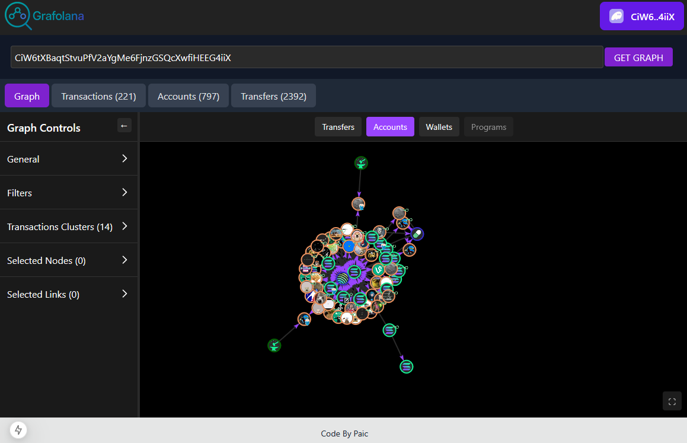
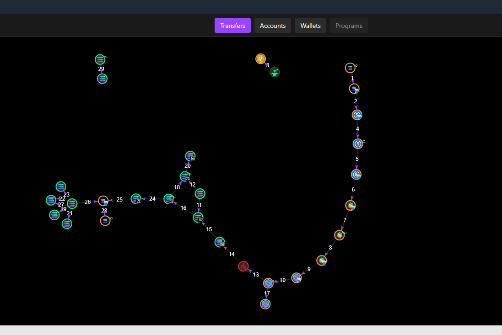
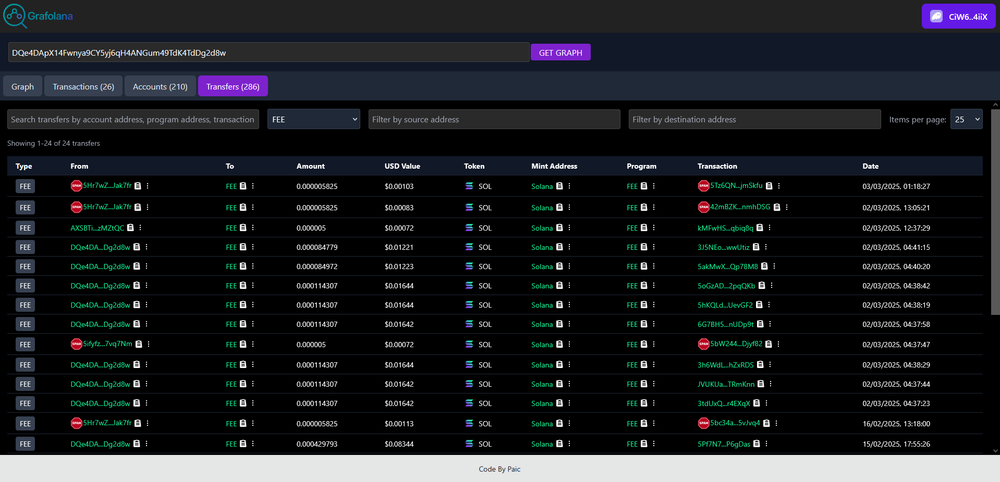

# Grafolana

Grafolana is a Forensic Analysis Tool for the Solana ecosystem.
It provides with precise tracking and visualization of on-chain fund movements using a graph based approach.

Developed for the [Helius REDACTED hackaton](https://earn.superteam.fun/hackathon/redacted/) in the [Solana Forensic Analysis Tool Category](https://earn.superteam.fun/listing/solana-forensic-analysis-tool/)


## Features

### Backend
- Retrieve graph data for transactions signatures
- Retrieve graph data for the last 1000 transactions of an account address
- Create Directed Acyclic Graph of each transaction by versionning accounts to avoid cycles
- Recognizes 144 differents swap instructions from 59 differents DEX programs
- Map transfers by parsing 17 differents instructions from Solana's Built in programs
- Offers 3 differents graph's views: Transers, Accounts and Wallets
- USD prices derivation mechanism for SPL token using swap's datas and Binance API for SOL prices
- Transactions Clustering algorithm that groups transactions by their graph's shape
- Fast & Failsafe RPC transactions batching using multiple RPC enpoints with loadbalancer respecting rate limits
- Metadata retrieval system for SPL tokens mints
- Storage of transactions and mint metadata in Database for fast retrieval
- Labelling system allowing users to edit labels for any address
- Spam (dusting) detection system using default address blacklist in database, user can mark address as spam

### UI Graph
- Unique field for loading graph data by transaction signatures or addresses
- Add multiple addresses/transactions to the same graph
- Interactive graph UI with right click context menu actions: copy address/rename/mark as spam/fix position
- "Address Label" component allowing to show addresses and interact with them
- Expand/Collapse swaps & swap routers transfers
- Hide/Show swaps operations
- Hide/Show spam transfers
- Hide/Show fee transfers
- Hide/Show of Create/Close accounts transfers
- Filters by amounts :SOL/SPL Token/USD Value
- Transactions clusters: Show specifics group of "lookalike" transactions 
- Contextual informations of selected nodes/links
- Select multiple Nodes while holding CTRL key
- Drag & Fix a node position by draging a node while holding ALT key
- Fullscreen mode

### UI Lists
- List of Transactions
- List of Accounts
- List of Transfers


### Design Choices
#### Swaps


When swaps are recognized by the system a virtual swap transfer representing the swap is added to the graph.
It allows to connect accounts together by this programmatic relationship.

I decided to connect the pools accounts used by the swaps as it "fills the gap" created in the flow:

User source account -> Pool 1 [GAP] Pool 2 -> User destination accounts

This is purely a technical choice to allow to link nodes and show a consolidated view of the flow and does not represents an actual transfer.

#### Burn & MintTo

Burn & Minto will appear as actual transfer leading or pointing to a virtual account that represents either its destination: burn or its source: mintto.

These nodes don't represents actual accounts and are just used to get a better view of what's happening while sticking to the graph's nodes/links concepts.

As detailed in the screenshot here, a virtual burn account might be used as a swap source account when the swap requires burning some token: here its a Sanctum's PrefundWithdrawStake.


## The View System


The View System offers 3 ways to look at the transactions datas.
Let's take an example with this transaction that covers a lot of use cases.
It's basically an arbitrage WSOL->WSOL
```
3vzGCmAaLkCBMm2Yk6jNyyWeApcd7YBevTRwWKEUeRZG2KeVYw3NE3pmMBbzY7CMqEZf9MgPJG8qXbHzdqC5A8iu
```

### Transfers View

This is a Transfers Centric view.

Each transaction as it's transfers mapped as Directed Acyclic Graph by versionning accounts to avoid cycles and offers a clear sequential view of the transfers executed by the transaction.
Each link is a transfer and the number represents its order in the sequence.

### Accounts View

This is an Accounts Centric view.

Contrary to the Transfers View where accounts can appear multiple time in one graph here each node is unique. So cycles appear and we can clearly recognize an arbitrage here.

### Wallets View

This is a Wallet Centric View.

Here Token accounts are aggregated behind the wallet's they belongs to.
This allow for an even more simplified view best for showcasing the relation between the actual wallets owning these accounts.


## FAQ

#### How do I add multiples transactions signatures/address to the graph?

1. First load the graph with an address/signature
2. Paste the second address in the field
3. A new Button will appear: "ADD TO GRAPH"
4. Click on "ADD TO GRAPH"

#### The graph is empty, why ?

An empty graph is a graph that has no transfers to show.
Some transactions don't have any transfers associated to them and as such won't appear on the graph.

Verify your Filter's settings and Hide/Show options in the "General" control panel.

#### It takes very long to load a graph

Yes, Solana Blockchain by nature makes it difficult to analyse transactions flow.
Each transactions has to be fetched individually. Which takes time and is dependent on the RPC API endpoints rates limits you're using.
Processing the transactions data to convert them to a graph takes time too.

The current live demo (https://grafolana.vercel.app/) uses 8 differents free tiers endpoints giving an average processing rate of 30 transactions per seconds.

Once a transaction has been fetched, it's save to the DB for faster retrieval

#### I've found a bug

YES !

Please let me know by : [filling an issue](https://github.com/JulienCouzinie/Grafolana/issues/new)


## Authors

- [@JulienCouzinie](https://www.github.com/JulienCouzinie)


## Demo
The app is currently live and accessible running on [Vercel](https://vercel.com) and its backend hosted by [Render](https://render.com/)

Due to current limitation of the free tiers used with Render, you might experience some lag occasionally as Render will spin down inactive app after a while which can delay requests by 50 seconds or more.

The app is accessible here 
[Grafolana DEMO : grafolana.vercel.app](https://grafolana.vercel.app/)


## Setup and Installation

### Prerequisites

#### Database
- PostgreSQL

You can use the [docker compose file](docker-compose.yml) to quickly spin up a PostgreSQL container o

#### Backend
- Python 3.10+
- [modules](GrafolanaBack/requirements.txt): 
   - base58==2.1.1
   - Flask==3.1.0
   - flask_Cors==5.0.0
   - Requests==2.32.3
   - solana==0.36.6
   - solders==0.26.0
   - diskcache==5.6.3
   - networkx==3.4.2
   - aiohttp==3.11.14
   - SQLAlchemy==2.0.31
   - alembic==1.13.1
   - psycopg2-binary==2.9.10
   - python-dotenv==1.1.0
   - APScheduler==3.11.0
   - Flask-Compress==1.17
   - portalocker==3.1.1

### Front:
- Node.js 18+
- pnpm

## SETUP
#### Backend
##### Environment Variables

Database Environment Variables :
```
DB_USER=
DB_PASSWORD=
DB_HOST=
DB_PORT=
DB_NAME=
```

Flask Settings
```
FLASK_APP=app.py
FLASK_ENV=development
FLASK_DEBUG=1
```

Cache Setting (not recommended to enable cache, it's still in dev)
```
ENABLE_CACHE=false
```

By default the Flask endpoints listens on all interfaces ip addresses on port 5000.
You can specify a port with the PORT environnement variables
Ex:
```
PORT=1234
```

Some RPC calls uses single rpc endpoint, define here your main rpc endpoint
```
SOLANA_RPC_URL=https://your.rpc-endpoint.com
```

Defining RPC endpoints for the RPC loadbalancer:
Each RPC endpoint should follow the format [URL]:[MAX-RATE-LIMIT-PER-SECOND]
Ex: 
```
HELIUS=https://mainnet.helius-rpc.com/?YOUR-HELIUS-API-KEY:5
QUICKNODE=https://YOUR-QUICKNODE-API-KEY.solana-mainnet.quiknode.pro/237ced2cfac7e190db7119d5536660c71b57de48:15
ALCHEMY=https://solana-mainnet.g.alchemy.com/v2/YOUR-ALCHEMY-API-KEY:25
SYNDICA=https://solana-mainnet.api.syndica.io/api-key/YOUR-SYNDICA-API-KEY:15
CHAINSTACK=https://solana-mainnet.core.chainstack.com/YOUR-CHAINSTACK-API-KEY:2
W3NODE=https://solana.w3node.com/YOUR-W3NODE-API-KEY/api:25
PUBLICNODE=https://solana-rpc.publicnode.com:10,https://rpc.shyft.to?api_key=YOUR-PUBLICNODE-API-KEY:25

SOLANA_RPC_ENDPOINTS=${HELIUS},${QUICKNODE},${ALCHEMY},${SYNDICA},${CHAINSTACK},${W3NODE},${PUBLICNODE}
```

#### Installation
    First set PYTHONPATH to correct Path
    ```export PYTHONPATH=/f/Développement/Python/Grafolana```

    1. Open backend folder

    ```cd GrafolanaBack/```

    2. Create and activate a python Virtual Environment:
    ```
    python -m venv venv
    source ./venv/Scripts/Activate
    ```

    3. Install all required packages:
    ```
    pip install -r requirements.txt
    ```

    4. Start PostgreSQL using Docker:
    ```
    cd ..
    docker-compose up -d postgres
    ```

    5. Run database migrations:
    ```
    cd GrafolanaBack
    python -m alembic upgrade head
    ```

#### Frontend
##### Environment Variables
Define your API route to your backend server.
Ex for a local install:
```
NEXT_PUBLIC_BACKEND_URL=http://localhost:5000/api
```

##### Installation

    1. Open frontend folder
    cd GrafolanaFront

    2. Install the dependencies
    pnpm install

    3. Build the artifacts
    pnpm build

    4. Environement VAR (see at the end of this file)


#### Deployment
##### Backend
```
cd GrafolanaBack
flask run --host=0.0.0.0 --no-reload --no-debug
```

##### Frontend:
```
cd GrafolanaFront
pnpm start
```


## License
[MIT](https://choosealicense.com/licenses/mit/)


## Screenshots





## Acknowledgements

 - [Solscan](https://solscan.io/) For providing the best Solana block explorer available. I spent hundreds hours lookings at transactions on their website. They are the best ! =)
 - [NetworkX](https://networkx.org/) Brilliant Python library for handling graph.
 - [React Force Graph](https://github.com/vasturiano/react-force-graph) Amazing React UI library to showcase graph using [D3 Force engine](https://d3js.org/) 
 - [ClaudeAI](https://claude.ai/) For providing more codes than bugs and usually fixing them.
 - [ChatGPT](https://chatgpt.com/) For providing neat graphics.
 - [Dad & Mum](https://nolink.io) For the non-stop support they gave me while I binge coded this app.


